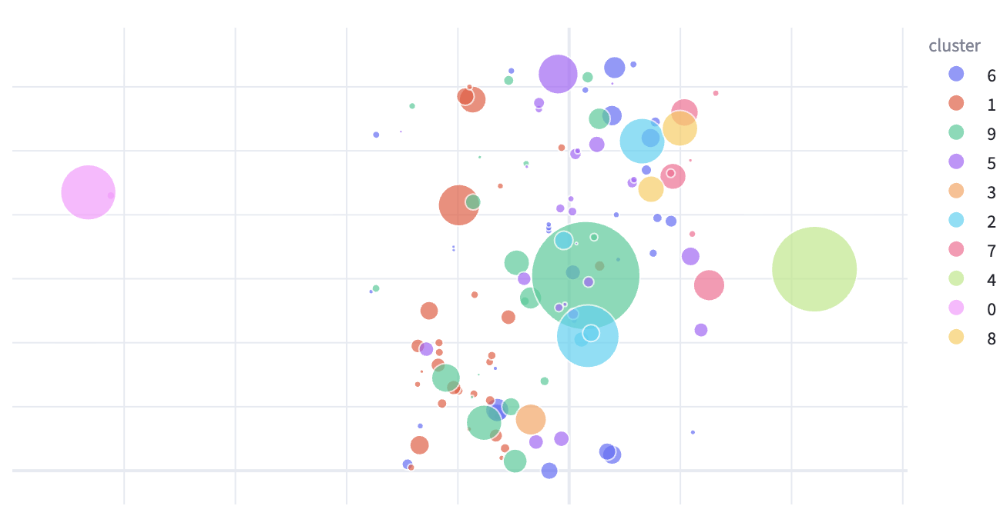
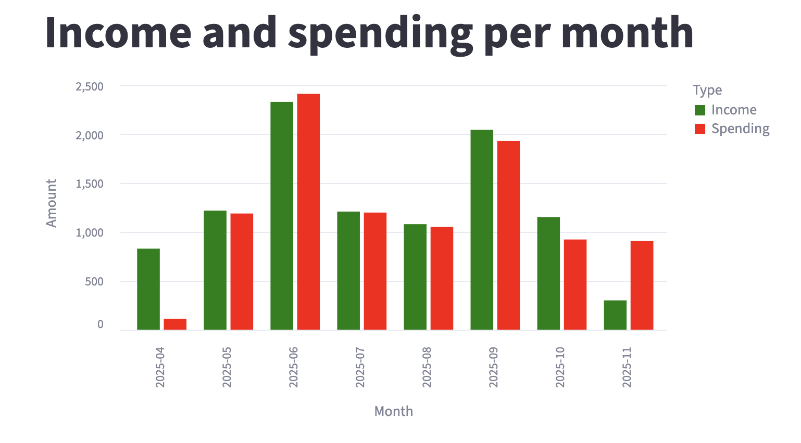
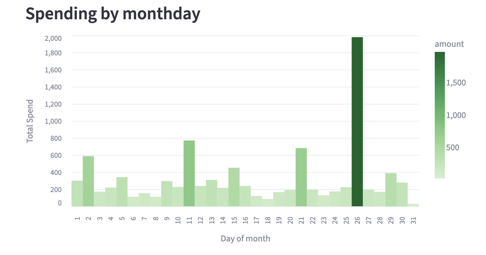

# Financial Dashboard

### [Dashboard Website](https://finance.moehring.xyz)

A Streamlit-based dashboard for importing, parsing, normalizing, and visualizing personal finance transaction data.  
The tool supports multiple bank export formats and produces a unified, analysis-ready dataset with interactive charts.

## Features

- Upload CSV and PDF bank exports (Comdirect, ING, C24, C24 PDF).
- Automatic format detection and parsing into a standardized schema.
- Cleansing and normalization (date parsing, category translation, amount normalization, month extraction).
- Interactive filtering by account, category, date range, or keyword.
- Altair-based visualizations for spending trends, category breakdowns, and monthly summaries.
- Local/remote mode toggle for data storage behavior.

## Project Structure

```
dash.py                 # Streamlit application
dashboard_utility.py    # utility
parsers.py              # parsers for statements
```

## Installation and Usage

Docker-Compose: `docker-compose up`

Docker: `docker run -p 8501:8501 finance-app`

or just: `pip install -r requirements.txt`

and then: `streamlit run dash.py`

## Supported Input Formats

- Comdirect CSV
- TradeRepublic PDF
- OLB CSV
- Generic CSV (fallback, if structure is compatible)

## Dashboard

The dashboard provides multiple perspectives on personal financial activity.  
After importing and parsing transaction data, the interface generates interactive visualizations that highlight trends, spending clusters, and temporal patterns.

These are examplary sourced from randomizing one of my own statements files.

### Clustering Overview

Displays grouped spending behavior based on categorized / embedded transaction details.



### Income and Outcome Breakdown

A bar chart comparing monthly income and expenses.
Helps track overall financial balance and detect unusual spending spikes.



### Month–Day Heatmap

Shows spending intensity across all days of the month.



### Weekday Heatmap

Aggregates transactions by weekday and time to reveal behavioral tendencies.


